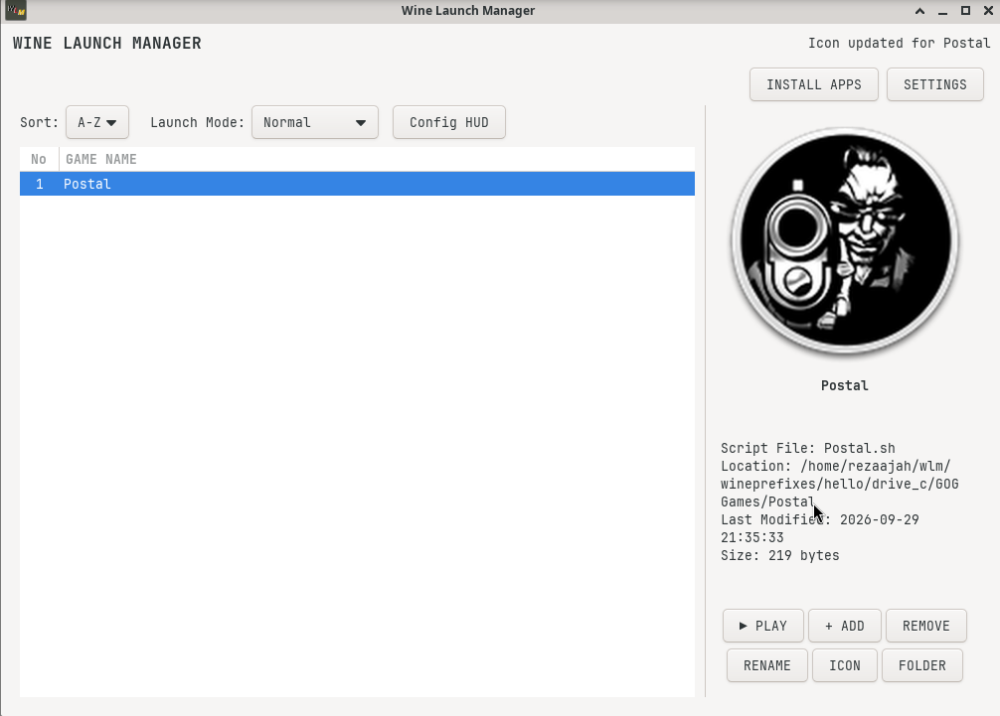
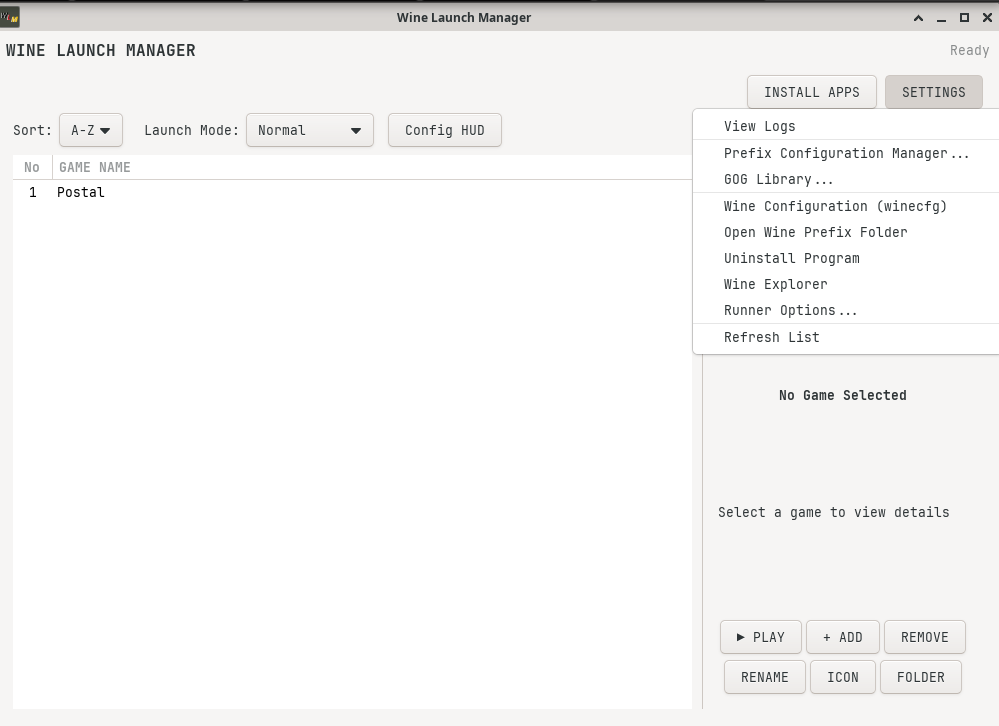

# WLM - Wine Launch Manager

Wine Launch Manager (WLM) is a GTK3-based application for managing Vanilla Wine applications on Linux distributions.

---

## Screenshot

---

## How to Use WLM?

### **Before Using, Ensure:**

1. You have installed Wine Vanilla correctly according to your distro.
2. You have installed the following packages:
   ```libgtk-3-0 libcurl4 libarchive13 libwebkit2gtk-4.1-0```
   *(Use the commands below or adjust according to your distribution.)*

---

## Install the required components or packages

### **Debian 13 / Ubuntu 24.04**
```bash
sudo apt install libgtk-3-0 libcurl4 libarchive13 libwebkit2gtk-4.1-0
```

### **Arch Linux / Manjaro**
```bash
sudo pacman -Syu
sudo pacman -S gtk3 curl libarchive webkit2gtk-4.1
```

### **Fedora**
```bash
sudo dnf install gtk3 libcurl libarchive webkit2gtk4.1
```
---
### Build it yourself
Here's the packages that you'll need to have in your system to build WLM on your system

### **Debian 13 / Ubuntu 24.04**
```bash
sudo apt install g++ cmake pkg-config libgtk-3-dev libarchive-dev \
                 libcurl4-openssl-dev nlohmann-json3-dev libwebkit2gtk-4.1-dev
```

### **Arch Linux**
```bash
sudo pacman -S base-devel cmake pkgconf gtk3 libarchive curl nlohmann-json webkit2gtk-4.1
```
### **Fedora**
```bash
sudo dnf install gcc-c++ cmake pkgconf-pkg-config gtk3-devel libarchive-devel \
                 libcurl-devel json-devel webkit2gtk4.1-devel
```
---
## Features:

- Manage Vanilla Wine applications via a user-friendly GUI.
- Uninstall applications installed within Wine.
- Display FPS using GalliumHUD or MangoHUD.
- Create and manage shortcut lists in the Launcher.
- GOG Integration.
- Manage Prefixes for Wine and Proton.
- Download ProtonGE/ProtonCachyOS within the launcher.
  
---
## How to Play?
1. **Play Button**: Runs the application that has been added to the shortcut list.
2. **Rename Button**: Renames the shortcut in the list.
3. **Remove Button**: Deletes an application from the shortcut list.
4. **Add Button**: Adds an application to the shortcut list menu (.exe file).
5. **Change Icon Button**: Changes the launcher icon (*.ico, *.png).
6. **Launch Mode Button**: For Counter FPS using GalliumHUD & Mangohud (GL or VK)

## WLM Settings

### **Settings Menu:**

- **View Logs**: Viewing logs of games or apps that currently run with Wine or Proton
- **Prefix Configuration Manager**: A menu for managing your prefix, such as create, remove, backup as archive and restore.
- **GOG Library**: A menu to show your GOG library.
- **Wine Configuration (winecfg)**: Opens up the winecfg menu in your home prefix of Wine.
- **Open Wine Prefix Folder**: Open your Wine prefix in your home folder.
- **Uninstall Program**: Uninstall any program in your Wine prefix.
- **Wine Explorer**: Opens up explorer in your Wine prefix.
- **Runner Options**: A menu to manage your runner.
- **Refresh List**: Refresh list of your games.

---
